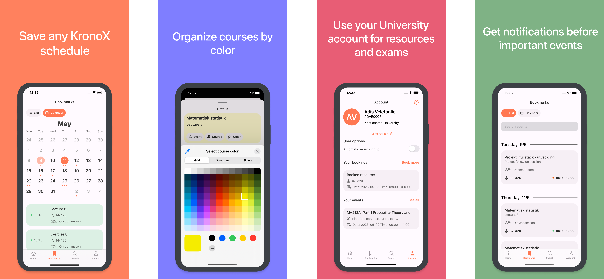

An app to find any KronoX schedule.

- [Download](https://apps.apple.com/se/app/tumble-for-kronox/id1617642864) on the App Store
- Save multiple schedules locally to your phone, from different universities.
- Schedules you save are updated automatically on start.
- Set notifications for events in schedules, or entire courses in a schedule.
- Log in to your KronoX through a specific university and sign up for exams and book resources/rooms.
- Customize colors for each course.
- Automatic exam signup.

## What's Included

- A fully-functional app.
- Examples of a bunch of API implementations.
- Examples of interaction with external APIs.
- Lots of custom UI.

## Built with

- [Realm](https://realm.io)
- [FSCalendar](https://github.com/WenchaoD/FSCalendar)
- [Firebase](https://firebase.google.com)

## Community

Author | Contributing | Need Help?
--- | --- | ---
Tumble is made by [adisve](https://github.com/adisve) and [BlieNuckel](https://github.com/BlieNuckel). | All contributions are welcome. Just [fork](https://github.com/adisve/Tumble-iOS/fork) the repo, then make a pull request. | Open an [issue](https://github.com/adisve/Tumble-iOS/issues) or join the [Discord server](https://discord.gg/3NDpKFcv). You can also reach me on [LinkedIn](https://www.linkedin.com/in/adis-veletanlic-2b51b4229/).
> **Note**  
> If you like Tumble, download it from the [App Store](https://apps.apple.com/se/app/tumble-for-kronox/id1617642864)!

