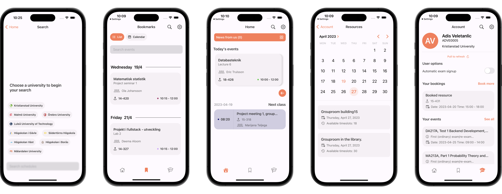

An app to find any KronoX schedule.

- [Download](https://apps.apple.com/se/app/tumble-for-kronox/id1617642864) on the App Store
- Save multiple schedules locally to your phone, from different universities.
- Schedules you save are updated automatically on start.
- Set notifications for events in schedules, or entire courses in a schedule.
- Log in to your KronoX through a specific university and sign up for exams and book resources/rooms.
- Customize colors for each course.
- Automatic exam signup.



## What's Included

- A fully-functional app.
- Examples of a bunch of API implementations.
- Examples of interaction with external APIs.
- Lots of custom UI.

## Built with

- [Realm](https://realm.io)
- [FSCalendar](https://github.com/WenchaoD/FSCalendar)
- [Firebase](https://firebase.google.com)

## Community

Author | Contributing | Need Help?
--- | --- | ---
Find is made by [adisve](https://github.com/adisve) and [BlieNuckel](https://github.com/BlieNuckel). | All contributions are welcome. Just [fork](https://github.com/adisve/tumble-ios/fork) the repo, then make a pull request. | Open an [issue](https://github.com/adisve/tumble-ios/issues) or join the [Discord server](https://discord.gg/GQmNzuQs). You can also reach me on [LinkedIn](https://www.linkedin.com/in/adis-veletanlic-2b51b4229/).

## License

```
MIT License

Copyright (c) 2023 A. Veletanlic, L. R. Poulsen

Permission is hereby granted, free of charge, to any person obtaining a copy
of this software and associated documentation files (the "Software"), to deal
in the Software without restriction, including without limitation the rights
to use, copy, modify, merge, publish, distribute, sublicense, and/or sell
copies of the Software, and to permit persons to whom the Software is
furnished to do so, subject to the following conditions:

The above copyright notice and this permission notice shall be included in all
copies or substantial portions of the Software.

THE SOFTWARE IS PROVIDED "AS IS", WITHOUT WARRANTY OF ANY KIND, EXPRESS OR
IMPLIED, INCLUDING BUT NOT LIMITED TO THE WARRANTIES OF MERCHANTABILITY,
FITNESS FOR A PARTICULAR PURPOSE AND NONINFRINGEMENT. IN NO EVENT SHALL THE
AUTHORS OR COPYRIGHT HOLDERS BE LIABLE FOR ANY CLAIM, DAMAGES OR OTHER
LIABILITY, WHETHER IN AN ACTION OF CONTRACT, TORT OR OTHERWISE, ARISING FROM,
OUT OF OR IN CONNECTION WITH THE SOFTWARE OR THE USE OR OTHER DEALINGS IN THE
SOFTWARE.
```

<br>

> **Note**  
> You can technically clone Tumble and sell it on the App Store, but we'd appreciate it if you didn't do this. Instead, please make any changes you want to the main repo — all pull requests are welcome!

> **Note**  
> If you like Tumble, download it from the [App Store](https://apps.apple.com/se/app/tumble-for-kronox/id1617642864)!